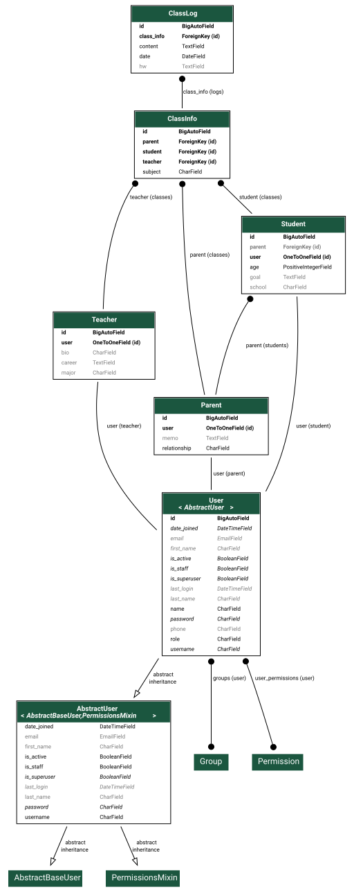

# 1. 개요

- 선생님, 학부모, 학생 간의 수업 정보를 공유하고 학습 일지를 기록하는 서비스입니다.

# 2. ERD

# 3. 세부 사항

## (1) 인증 및 회원 관리 (account)

- `APIView` 활용
- 선생님, 학생, 학부모별로 상이한 회원가입을 구현하기 위해 `APIView` 사용
- 로그인은 역할에 관계 없이 공통된 인증 로직 적용

## (2) 수업 및 일지 관리 (tutoring)

- `ModelViewSet` 사용
- 수업 및 수업 일지는 전형적인 CRUD 패턴을 따르므로, 이를 자동화하고자 `ViewSet` 사용
- `get_queryset()` 및 `perform_create()` 오버라이딩, `get_object_or_404()`을 이용하여 로그인한 유저와 관련된 데이터에만 접근할 수 있도록 제한
